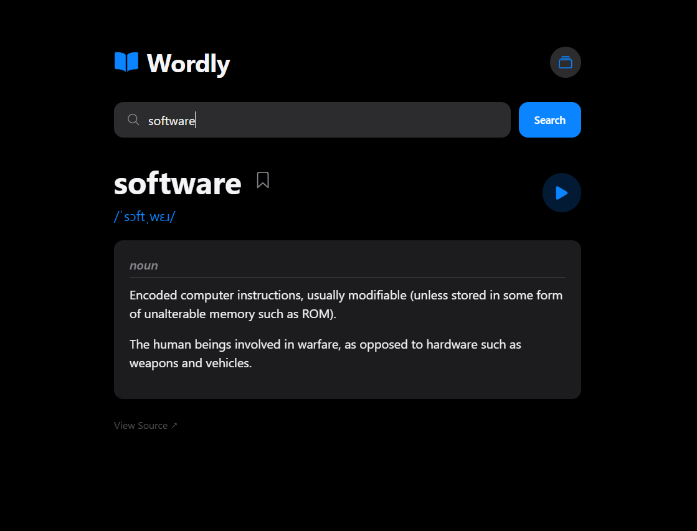

# Wordly - Dictionary Web App

A sleek, modern dictionary application built with vanilla HTML, CSS, and JavaScript. Inspired by Apple's design language, Wordly provides a clean and intuitive interface for looking up word definitions, pronunciations, and managing your vocabulary library.

## Features

### Core Functionality
- **Real-time Word Lookup**: Search for any English word using the free DictionaryAPI
- **Pronunciation Audio**: Listen to word pronunciations with a single click
- **Comprehensive Definitions**: View multiple definitions organized by part of speech
- **Examples & Synonyms**: Get contextual examples and related words for better understanding

### Library Management
- **Saved Words**: Bookmark your favorite or challenging words for quick access
- **Search History**: Automatically track your recent searches
- **Local Storage**: All data is saved locally in your browser - no server required

### Design & Experience
- **Apple-inspired UI**: Clean, minimalist design with dark theme
- **Responsive Layout**: Works seamlessly on desktop, tablet, and mobile devices
- **Smooth Animations**: Subtle transitions and loading states for a polished feel
- **Keyboard Navigation**: Full keyboard support for accessibility

## Screenshots



*Main interface showing word search results with definitions, pronunciation, and library management features.*

## Tech Stack

- **Frontend**: Vanilla HTML5, CSS3, JavaScript (ES6+)
- **API**: [DictionaryAPI.dev](https://dictionaryapi.dev/) - Free dictionary API
- **Icons**: Ionicons for crisp, scalable icons
- **Storage**: Browser LocalStorage for persistent data

## Installation & Usage

### Local Development

1. **Clone the repository:**
   ```bash
   git clone https://github.com/Kip-opp/wordly.git
   cd wordly
   ```

2. **Open in browser:**
   Simply open `index.html` in any modern web browser. No build process required!

   ```bash
   # Or serve locally with Python (optional)
   python -m http.server 8000
   # Navigate to http://localhost:8000
   ```

### Usage Instructions

1. **Search for a word**: Type any English word in the search bar and click "Search" or press Enter
2. **Listen to pronunciation**: Click the play button to hear the word spoken
3. **Save words**: Click the bookmark icon to save words to your library
4. **Access library**: Click the library icon (albums) in the top-right to view saved words and search history
5. **Quick search**: Click any word in your library to search it instantly

## Project Structure

```
wordly/
├── index.html          # Main HTML structure
├── style.css           # Apple-inspired CSS styling
├── script.js           # Core JavaScript functionality
└── README.md           # This file
```

## API Integration

Wordly uses the free [DictionaryAPI.dev](https://dictionaryapi.dev/) service, which provides:
- Word definitions from multiple sources
- Phonetic transcriptions
- Audio pronunciations
- Part-of-speech categorization
- Example sentences
- Synonyms and related words

**Note**: This is a free API with rate limits. For production use, consider implementing caching or using a paid dictionary API service.

## Browser Compatibility

Wordly supports all modern browsers:
- Chrome (recommended)
- Firefox
- Safari
- Edge
- Opera

## Contributing

Contributions are welcome! Please feel free to submit a Pull Request.

1. Fork the repository
2. Create your feature branch (`git checkout -b feature/amazing-feature`)
3. Commit your changes (`git commit -m 'Add some amazing feature'`)
4. Push to the branch (`git push origin feature/amazing-feature`)
5. Open a Pull Request

## License

This project is open source and available under the [MIT License](LICENSE).

## Support

If you encounter any issues or have suggestions for improvements:
- Check the [Issues](https://github.com/your-username/wordly/issues) section
- Submit a new issue with detailed information
- Include your browser version and operating system

## Future Enhancements

Planned features for future versions:
- [ ] Dark/Light theme toggle
- [ ] Word of the day notifications
- [ ] Export saved words functionality
- [ ] Advanced search filters
- [ ] Offline mode with cached words
- [ ] Multi-language support

---

**Wordly** - Expand your vocabulary, one word at a time. 📚✨